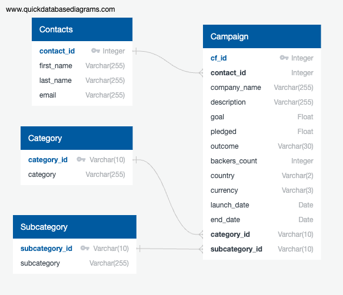

# Crowdfunding ELT Project

**Team members:**  Tania Barrera, Vinay Vattipally, Jacky Zhang & Archit Hallan.

This repo contains our work for the second project of the UofT SCS edX Data Bootcamp: the ETL Mini Project.

## Deliverables

Notebook: [ETL_Mini_Project_TBarrera_AHallan_VVattipally_JZhang.ipynb](ETL_Mini_Project_TBarrera_AHallan_VVattipally_JZhang.ipynb)

This notebook goes over the whole project from data cleaning and exploration to creating a Postgres database using `sqlalchemy`, creating the db tables and uploading the data to them, as well as querying them.

However, you can also find the database schema that creates the tables in this file: [crowdfunding_db_schema.sql](crowdfunding_db_schema.sql)

---

## Dependencies

The modules we used for the project are for the most part the same as the ones used in class, with the exception of `sqlalchemy_utils` and `psycopg2`. Make sure you install these modules before running the notebook with:


``` python
pip install sqlalchemy_utils
pip install psycopg2
```

The rest of the modules should already be installed in your python environment, but for completeness here is a list of them:

- `pandas`
- `numpy`
- `json`
- `sqlalchemy`

## Database schema

The last section of the project goes over database creation. This diagram shows the schema of our database:



## Other notes

1. In addition to making sure all dependencies are installed before running the notebook, you should also make sure the data that will be added does not already exist in the database table. If it does, there will be an error due to the constraint that ensures unique primary keys.

2. The contacts dataframe was cleaned using option 1 as described in the instructions (i.e. dictionary methods).

3. The schema uses the `Varchar` data type, since that is the PostgreSQL type. However, when using `sqlalchemy` to desclare and create the tables, we use the `String` object type for those columns.

---

## References

Data for this dataset was generated by edX Boot Camps LLC, and is intended for educational purposes only.

Some code sections were based on edX Datacamp class activities, as well as external sources. The later are acknowledged within the code comments.
